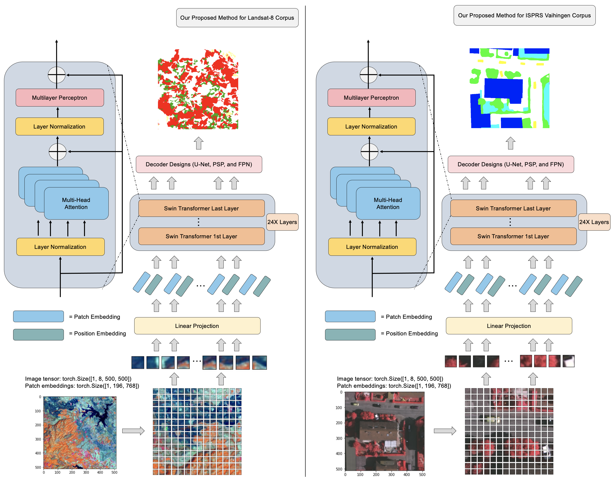
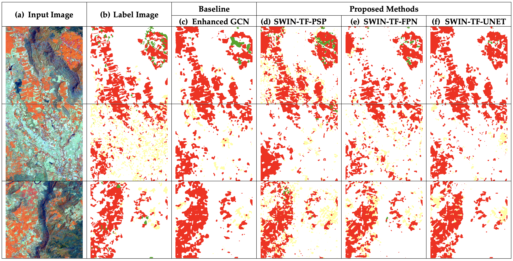
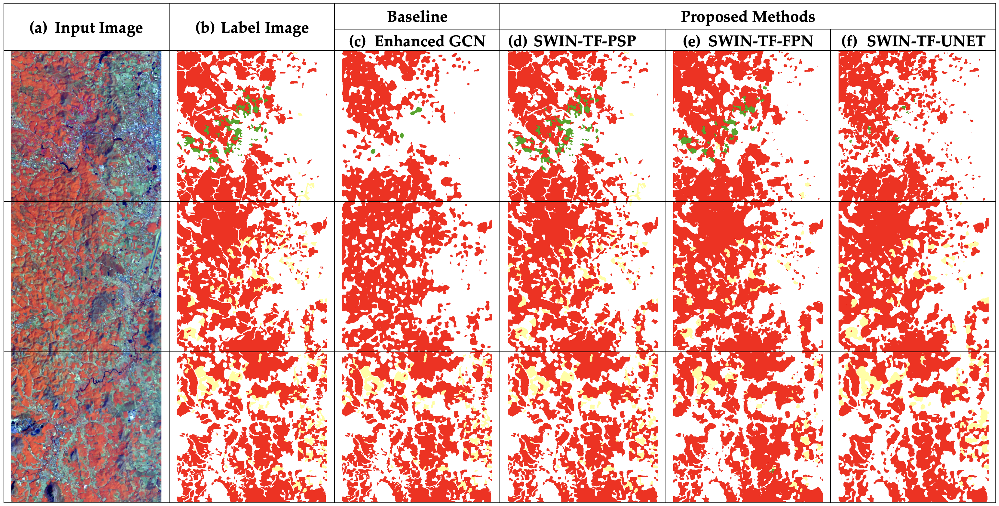
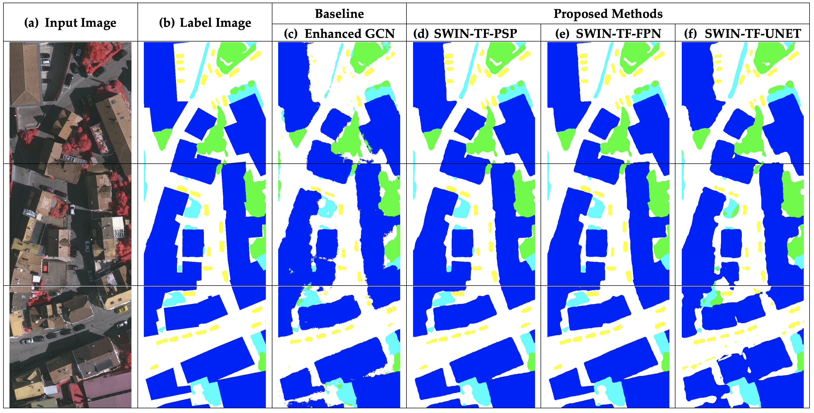

# Transformer-Based Decoder Designs for Semantic Segmentation on Remotely Sensed Imagesased Enhanced Global Convolutional Network with High-Resolution Representations and Depthwise Atrous Convolution

Author: Teerapong Panboonyuen

Our previous work: 


[1] Panboonyuen, T.; Jitkajornwanich, K.; Lawawirojwong, S.; Srestasathiern, P.; Vateekul, P. Semantic Labeling in Remote Sensing Corpora Using Feature Fusion-Based Enhanced Global Convolutional Network with High-Resolution Representations and Depthwise Atrous Convolution. Remote Sens. 2020, 12, 1233. https://doi.org/10.3390/rs12081233
[2] Panboonyuen, T.; Jitkajornwanich, K.; Lawawirojwong, S.; Srestasathiern, P.; Vateekul, P. Semantic Segmentation on Remotely Sensed Images Using an Enhanced Global Convolutional Network with Channel Attention and Domain Specific Transfer Learning. Remote Sens. 2019, 11, 83. https://doi.org/10.3390/rs11010083

GCN152-TL-A (our previous model) are developed based on the ResNet-152 backbone with Channel Attention and Domain Specific Transfer Learning:

<p align="center">

</p>

<p align="center">

</p>


Updates:

  - **October 31, 2021: Fixed a few bugs and updated all checkpoints/**
  - **We will provide full codes after our latest article have been published.**

## 1. Pretrained HR-GCN-FF-DA Checkpoints

We have provided a list of EfficientNet checkpoints for Pretrained SwinTF with decoder designs checkpoints:.

  ** All these best checkpoints are trained with HR-GCN-FF-DA network.
  
  - Drive (Pretrained of SwinTF-FPN for ISPRS Vaihingen): https://drive.google.com/open?id=1J7YClrBRlm9Oo8c8Xq621N_J0B_RYW2d

  - Drive (Pretrained of SwinTF-PSP for Isan (Thailand) corpus): https://drive.google.com/open?id=1kWWoQwSZx73e_lWElNT2Yebax4xU5FmB

  - Drive (Pretrained of SwinTF-PSP for North (Thailand) corpus): https://drive.google.com/open?id=1WtqrrIC4-_5aQwMsUqgpjZQ3Kyk4t1PK


## 2. Run inference.

Files and Directories

- **train.py:** Training on the dataset of your choice. Default is Landsat-8w3c

- **test.py:** Testing on the dataset of your choice. Default is Landsat-8w3c

### Installation
This project has the following dependencies:

- TensorFlow `sudo pip install --upgrade tensorflow-gpu`

- OpenCV Python `sudo apt-get install python-opencv`

### Usage
The only thing you have to do to get started is set up the folders in the following structure:

    ├── "corpus_name"                   
    |   ├── train
    |   ├── train_labels
    |   ├── val
    |   ├── val_labels
    |   ├── test
    |   ├── test_labels

Put a text file under the dataset directory called "our_class_dict.csv" which contains the list of classes along with the R, G, B colour labels to visualize the segmentation results. This kind of dictionairy is usually supplied with the dataset. Here is an example for the Landsat-8w5c dataset:

```
name,r,g,b
Agriculture or Harvested area,255,255,155
Forest,56,168,0
Urban,255,0, 0
Water,0, 122, 255
Miscellaneous,183, 140, 31
```

## 3. Results.
**Note:** If you are using any of the networks that rely on a pretrained SwinTF, then you will need to download the pretrained weights using the provided script on section 2. These are currently: Pretrained SwinTF-PSP and Pretrained SwinTF-FPN.

Then you can simply run `train.py`! Check out the optional command line arguments:

```
usage: train.py [-h] [--num_epochs NUM_EPOCHS]
                [--checkpoint_step CHECKPOINT_STEP]
                [--validation_step VALIDATION_STEP] [--image IMAGE]
                [--continue_training CONTINUE_TRAINING] [--dataset DATASET]
                [--crop_height CROP_HEIGHT] [--crop_width CROP_WIDTH]
                [--batch_size BATCH_SIZE] [--num_val_images NUM_VAL_IMAGES]
                [--h_flip H_FLIP] [--v_flip V_FLIP] [--brightness BRIGHTNESS]
                [--rotation ROTATION] [--model MODEL] [--frontend FRONTEND]

optional arguments:
  -h, --help            show this help message and exit
  --num_epochs NUM_EPOCHS
                        Number of epochs to train for
  --checkpoint_step CHECKPOINT_STEP
                        How often to save checkpoints (epochs)
  --validation_step VALIDATION_STEP
                        How often to perform validation (epochs)
  --image IMAGE         The image you want to predict on. Only valid in
                        "predict" mode.
  --continue_training CONTINUE_TRAINING
                        Whether to continue training from a checkpoint
  --dataset DATASET     Dataset you are using.
  --crop_height CROP_HEIGHT
                        Height of cropped input image to network
  --crop_width CROP_WIDTH
                        Width of cropped input image to network
  --batch_size BATCH_SIZE
                        Number of images in each batch
  --num_val_images NUM_VAL_IMAGES
                        The number of images to used for validations
  --h_flip H_FLIP       Whether to randomly flip the image horizontally for
                        data augmentation
  --v_flip V_FLIP       Whether to randomly flip the image vertically for data
                        augmentation
  --brightness BRIGHTNESS
                        Whether to randomly change the image brightness for
                        data augmentation. Specifies the max bightness change
                        as a factor between 0.0 and 1.0. For example, 0.1
                        represents a max brightness change of 10% (+-).
  --rotation ROTATION   Whether to randomly rotate the image for data
                        augmentation. Specifies the max rotation angle in
                        degrees.
  --model MODEL         The model you are using. See model_builder.py for
                        supported models
  --frontend FRONTEND   The frontend you are using. See frontend_builder.py
                        for supported models

```

## Results

These are some **sample results** for the Isan (Thailand) corpus with 3 classes 

<p align="center">

</p>

These are some **sample results** for the North (Thailand) corpus with 3 classes 

<p align="center">

</p>


These are some **sample results** for the ISPRS Vaihingen with 5 classes 

<p align="center">

</p>

For more instructions about training on GPUs, please refer to the following tutorials:

  * Tensorflow tutorial: https://www.tensorflow.org/install/gpu

NOTE: this is still not an official code (untill we have published our article).

## Reference

[1] https://github.com/VXallset/deep-high-resolution-net.TensorFlow

[2] https://github.com/hsfzxjy/HRNet-tensorflow

[3] https://github.com/GeorgeSeif/Semantic-Segmentation-Suite

[4] https://github.com/yoninachmany/raster-vision-deepglobe-semseg